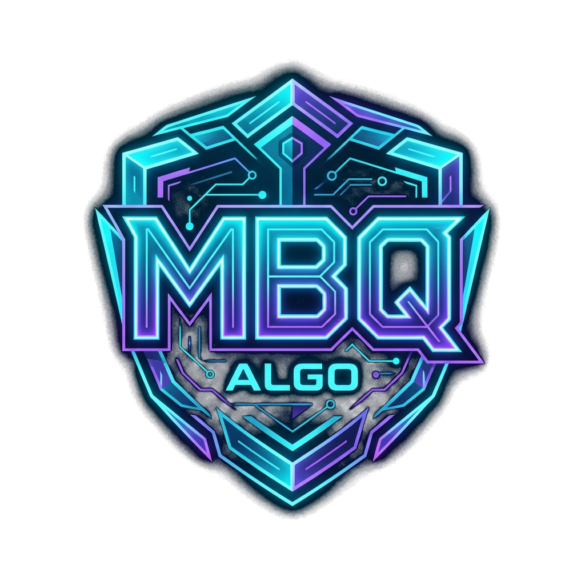

# MBQ ALGO — Next-Generation Trading Intelligence SaaS



> **Enterprise-grade trading indicator ecosystem and SaaS platform outperforming generic tools like SwiftAlgo.**
> Built with 100% strictly non-repainting Pine Script v5 algorithms, native Pakistani payment rails (Meezan Bank, Safepay, PayFast, 1Link), an automated TradingView invite-only licensing worker, and an interactive customer portal.

---

## 🌟 Key Highlights & Competitive Advantages

| Feature | MBQ ALGO | Generic Tools (SwiftAlgo) |
|---|---|---|
| **Signal Integrity** | **100% Non-Repainting** upon bar confirmation | Frequent repainting & disappearing signals |
| **Pakistani Payments** | **Meezan Bank MPGS**, Safepay, PayFast, 1Link, Card, JazzCash, EasyPaisa | Whop only (USD/Credit card only, often declined) |
| **Customer Experience**| **Dedicated Customer Portal** (manage key, re-bind TV username, invoices) | No dashboard, manual Google form delivery |
| **Licensing Architecture** | **Dual-Layer Gate** (TradingView invite permission + Pine Script token) | Single point of failure |
| **Trend HUD** | **Live Multi-Timeframe Matrix** (5M, 15M, 1H, 4H, 1D on chart) | Single timeframe or cluttered extra charts |
| **Risk Management** | **Automated Dynamic TP1, TP2, TP3 & Trailing SL** | Generic static lines or manual guesswork |

---

## 🏗️ System Architecture

```
MBQ ALGO/
├── assets/                       # High-resolution transparent PNG logos & favicon suite
├── backend/
│   ├── routes/
│   │   ├── checkout.js           # Meezan Bank MPGS, Safepay & PayFast session creator
│   │   ├── webhook.js            # Cryptographic HMAC webhook processor
│   │   └── license.js            # License validation & TV username re-sync API
│   ├── services/
│   │   └── tradingviewAutomation.js # Automated TradingView invite-only worker
│   └── db.js                     # Local JSON persistence store
├── dist/                         # Production compiled frontend (Hostinger ready)
├── public/                       # Static public web assets
├── src/                          # React + Tailwind frontend source code
│   ├── components/               # Navbar, Hero, InteractiveChart, BentoFeatures,
│   │                             # Backtests, ComparisonTable, Reviews, Pricing,
│   │                             # CheckoutModal, CustomerDashboard, SetupGuideModal
│   ├── App.jsx
│   ├── index.css
│   └── main.jsx
├── tradingview/
│   ├── MBQ_ALGO_V5_Pro.pine      # Production-grade Pine Script v5 indicator
│   └── TRADINGVIEW_SETUP_GUIDE.md # Step-by-step master setup documentation
├── server.js                     # Master Express production server
├── .htaccess                     # LiteSpeed/Apache SPA router for Hostinger
├── ecosystem.config.js           # PM2 process clustering config for Hostinger
├── DEPLOYMENT_GUIDE_HOSTINGER.md # Detailed Hostinger deployment walkthrough
└── .env.example                  # Environment configuration template
```

---

## 💳 Pakistani Payment Gateway Integration

MBQ ALGO provides full support for Pakistani financial rails:

1. **Meezan Bank MPGS (Mastercard Payment Gateway Services):**
   - Direct corporate merchant integration with Meezan Bank eCommerce gateway.
   - Accepts Meezan Bank Visa / Mastercard debit & credit cards with 3D Secure 2.0.
2. **Safepay Pakistan:**
   - Instant developer-friendly checkout API supporting Meezan Bank, Bank Alfalah, Habib Bank, Standard Chartered, and all **1Link PayPak** cards, plus **JazzCash** and **EasyPaisa**.
3. **PayFast (APPS Pakistan):**
   - Direct bank-to-bank account debiting across Pakistani financial institutions.
4. **Cryptographic License Issuance:**
   - Every completed checkout issues an encrypted HMAC-SHA256 license token (`MBQ-PRO-XXXX-XXXX`) and automatically syncs the buyer's TradingView username.

---

## 📈 TradingView "Invite-Only" Script System

MBQ ALGO protects your algorithmic intellectual property using TradingView's invite-only permissioning system:

- **Source Code Hidden:** Compiled server-side by TradingView; buyers never see or copy the raw Pine Script code.
- **Automated Access Management:** The background service in `backend/services/tradingviewAutomation.js` calls TradingView's internal permissions endpoint to grant and revoke access based on subscription status.
- **Client Setup Guide:** Complete guide available in [`tradingview/TRADINGVIEW_SETUP_GUIDE.md`](tradingview/TRADINGVIEW_SETUP_GUIDE.md) and inside the web app modal.

---

## 🚀 Local Development

### 1. Install Dependencies
```bash
npm install
```

### 2. Configure Environment
Duplicate `.env.example` to `.env`:
```bash
cp .env.example .env
```

### 3. Run Development Servers
```bash
# Run frontend dev server (Vite)
npm run dev

# Run master API server
npm run server
```

### 4. Build for Production
```bash
npm run build
```

---

## 🌐 Deploying to Hostinger

Follow the step-by-step walkthrough in [`DEPLOYMENT_GUIDE_HOSTINGER.md`](DEPLOYMENT_GUIDE_HOSTINGER.md):

1. Connect this GitHub repository (`Faheem1011/mbq-algo`) in **Hostinger hPanel -> Advanced -> Git**.
2. Add the Hostinger Webhook to GitHub Repository Settings for automatic continuous deployment.
3. For Node.js Hosting: Configure **Node.js** in hPanel pointing to `server.js`.
4. For Shared Web Hosting: Serve `dist/` directly with the included `.htaccess`.

---

## ⚖️ Legal & Risk Disclaimer

*Trading financial instruments on margin involves substantial risk and is not suitable for all investors. MBQ ALGO provides analytical and educational tools. Past performance is not indicative of future results.*

---

© 2026 MBQ ALGO (Pvt.) Ltd. All rights reserved.
